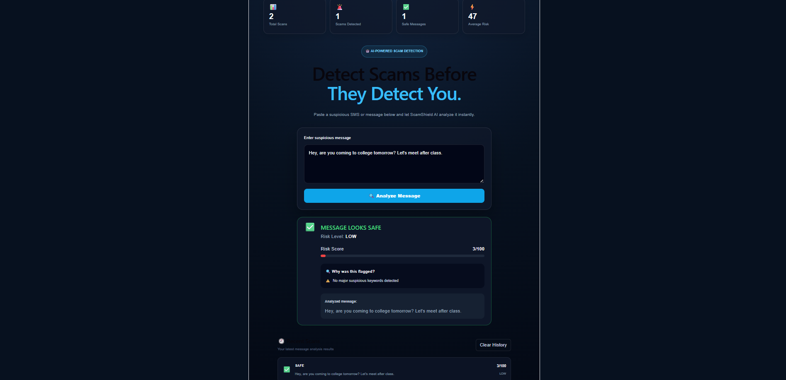

# 🛡️ ScamShield AI

### AI-Powered Scam Message Detection System

ScamShield AI is a machine-learning-based web application that analyzes suspicious SMS messages and detects whether they are likely to be **SCAM** or **SAFE**.

It provides a risk score, risk level, and suspicious indicators to help users understand why a message may be dangerous.

---

## 🚀 Features

- 🤖 AI-powered scam message detection
- 🚨 SCAM / SAFE classification
- 📊 Risk score from 0–100
- ⚡ LOW / MEDIUM / HIGH risk levels
- 🔍 Suspicious indicator detection
- 🕘 Recent scan history
- 📈 Dashboard statistics
- 🌐 React + Vite frontend
- ⚙️ FastAPI backend
- 🧠 Machine Learning model
- 📱 Responsive user interface

---

## 🖥️ Screenshots

### Dashboard


### Scam Detection


### Safe Message



---

## 🏗️ Project Architecture

```text
ScamShield-AI/
│
├── backend/
│   └── main.py
│
├── frontend/
│   ├── src/
│   │   ├── App.jsx
│   │   ├── App.css
│   │   └── main.jsx
│   ├── package.json
│   └── vite.config.js
│
├── ml/
│   ├── datasets/
│   │   └── SMSSpamCollection
│   │
│   ├── models/
│   │   └── message_model.pkl
│   │
│   └── src/
│       └── train_message_model.py
│
├── screenshots/
│   ├── dashboard.png
│   ├── scam-result.png
│   └── safe-result.png
│
├── requirements.txt
├── .gitignore
└── README.md